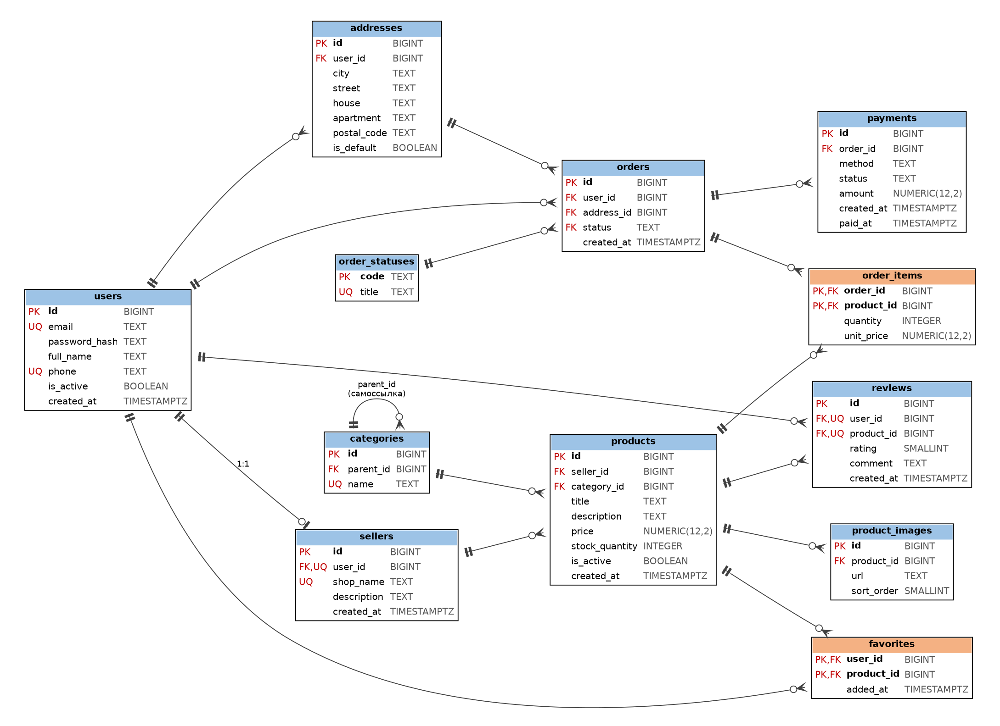

# Лабораторная работа №1. Проектирование и создание структуры базы данных маркетплейса

**СУБД:** PostgreSQL 12+. **Файлы работы:** `marketplace_schema.sql` (единый скрипт), `er_diagram.png` (ER-диаграмма).

> **Допущение.** Описание предметной области в методичке не приведено, поэтому я исходил из того, что в ней явно упоминается: продавцы, товары, категории с иерархией, заказы с позициями, отзывы, рейтинг товара. Недостающие для 10+ сущностей объекты (адреса, платежи, избранное, изображения, справочник статусов) добавлены по смыслу маркетплейса. Если в вашем описании состав сущностей другой, схему легко подправить.

---

## Шаг 1. Анализ предметной области и бизнес-правила

**Предметная область.** Маркетплейс: пользователи регистрируются и могут быть покупателями; владельцы магазинов (продавцы) выставляют товары, сгруппированные в дерево категорий; покупатели оформляют заказы с доставкой по своему адресу, оплачивают их, оставляют отзывы и добавляют товары в избранное.

| № | Бизнес-правило | Как обеспечивается в схеме |
|---|---|---|
| 1 | Пользователь идентифицируется уникальным email (без учёта регистра) | `users.email UNIQUE` + `CHECK (email = lower(email))` |
| 2 | Продавец — это пользователь с магазином; у пользователя не более одного магазина, название магазина уникально | `sellers.user_id UNIQUE`, `sellers.shop_name UNIQUE` |
| 3 | У товара ровно один продавец | `products.seller_id NOT NULL` + FK |
| 4 | Товар относится ровно к одной категории; категории образуют дерево | `products.category_id NOT NULL`; `categories.parent_id` — самоссылка |
| 5 | Цена товара положительна, остаток неотрицателен | `CHECK (price > 0)`, `CHECK (stock_quantity >= 0)` |
| 6 | У одного продавца не бывает двух товаров с одинаковым названием | `UNIQUE (seller_id, title)` |
| 7 | Нельзя удалить продавца или категорию, у которых есть товары, и категорию, у которой есть подкатегории | `ON DELETE RESTRICT` |
| 8 | Заказ принадлежит одному покупателю и доставляется на адрес **этого же** покупателя | составной FK `orders(address_id, user_id) → addresses(id, user_id)` |
| 9 | Заказ содержит хотя бы одну позицию | отложенный триггер-ограничение (проверка при `COMMIT`) |
| 10 | Товар входит в заказ одной позицией, количество положительно | `PRIMARY KEY (order_id, product_id)`, `CHECK (quantity > 0)` |
| 11 | Цена позиции фиксируется на момент покупки и не меняется при смене цены товара | `order_items.unit_price` |
| 12 | Товар, попавший в заказ, удалить нельзя (его снимают с продажи) | `order_items.product_id ON DELETE RESTRICT`, флаг `is_active` |
| 13 | При удалении заказа удаляются его позиции | `order_items.order_id ON DELETE CASCADE` |
| 14 | Статус заказа — значение из справочника, по умолчанию «новый» | FK на `order_statuses`, `DEFAULT 'new'` |
| 15 | Заказ может иметь несколько платежей (повторные попытки); у успешного платежа задана дата оплаты | таблица `payments`, `CHECK` на `paid_at` |
| 16 | Отзыв оставляется к конкретному товару конкретным пользователем, не более одного на пару; оценка от 1 до 5 | `UNIQUE (user_id, product_id)`, `CHECK (rating BETWEEN 1 AND 5)` |
| 17 | Товар можно добавить в избранное один раз | `PRIMARY KEY (user_id, product_id)` |
| 18 | У пользователя не более одного адреса «по умолчанию» | частичный уникальный индекс `WHERE is_default` |
| 19 | Сумма заказа не хранится, а вычисляется по позициям | отсутствие столбца (требование 3НФ) |

**Правила, которые остаются на уровне приложения:** отзыв только после покупки товара; списание остатка при оформлении заказа; отсутствие циклов в дереве категорий длиннее одного звена (прямую самоссылку запрещает `CHECK`).

---

## Шаг 2. ER-диаграмма



*Рисунок — Логическая схема базы данных.* Обозначения: `PK` — первичный ключ, `FK` — внешний ключ, `UQ` — уникальность. Оранжевым выделены ассоциативные таблицы. Значок `‖` у родителя — «ровно один», `○<` у потомка — «ноль или много», `‖○` — «ноль или один».

**Сущностей: 12** (`users`, `sellers`, `addresses`, `categories`, `products`, `product_images`, `order_statuses`, `orders`, `order_items`, `payments`, `reviews`, `favorites`).

| Связь | Тип | Реализация |
|---|---|---|
| users — sellers | 1:1 | `sellers.user_id UNIQUE` |
| users — addresses | 1:N | `addresses.user_id` |
| users — orders | 1:N | `orders.user_id` |
| addresses — orders | 1:N | `orders.address_id` (составной FK с `user_id`) |
| order_statuses — orders | 1:N | `orders.status` |
| orders — payments | 1:N | `payments.order_id` |
| sellers — products | 1:N | `products.seller_id` |
| categories — products | 1:N | `products.category_id` |
| products — product_images | 1:N | `product_images.product_id` |
| users — reviews, products — reviews | 1:N, 1:N | `reviews.user_id`, `reviews.product_id` |
| **orders — products** | **M:N** | ассоциативная таблица `order_items` |
| **users — products** (избранное) | **M:N** | ассоциативная таблица `favorites` |
| **categories — categories** | **иерархия** | самоссылка `categories.parent_id` |

Требования ТЗ выполнены: сущностей больше десяти, есть две связи «многие-ко-многим» через ассоциативные таблицы и одна иерархическая самоссылка.

---

## Шаг 3. Приведение к третьей нормальной форме

### Исходная (ненормализованная) таблица

Допустим, данные сначала хранились одной таблицей `orders_flat` с первичным ключом `(order_id, product_id)`:

| order_id | order_date | customer_email | customer_name | product_id | product_title | price | seller_id | shop_name | category | quantity |
|---|---|---|---|---|---|---|---|---|---|---|
| 101 | 2026-09-01 | ivan@mail.ru | Иван Петров | 7 | Клавиатура K2 | 3500 | 3 | Ромашка | Периферия | 1 |
| 101 | 2026-09-01 | ivan@mail.ru | Иван Петров | 9 | Мышь M1 | 1200 | 3 | Ромашка | Периферия | 2 |
| 102 | 2026-09-03 | anna@mail.ru | Анна Лебедева | 7 | Клавиатура K2 | 3500 | 3 | Ромашка | Периферия | 1 |

*(Ещё раньше товары одного заказа могли лежать в одной ячейке списком «Клавиатура K2, Мышь M1» — это нарушение 1НФ; оно устраняется выделением отдельной строки на каждую позицию, как в таблице выше.)*

### Аномалии

- **Аномалия обновления.** Магазин «Ромашка» переименовали. Название надо поменять во всех строках, где встречаются его товары; если пропустить хоть одну, данные противоречат друг другу. То же с названием товара и именем покупателя.
- **Аномалия вставки.** Нельзя добавить новый товар (или нового продавца, покупателя), пока по нему нет заказа: часть первичного ключа `order_id` не может быть `NULL`.
- **Аномалия удаления.** Если удалить единственный заказ с товаром «Мышь M1», из базы пропадут и сведения о самом товаре, его цене и продавце.

### Функциональные зависимости и нарушения

| Зависимость | Нарушение |
|---|---|
| `order_id → order_date, customer_email, customer_name` | 2НФ: зависимость от части составного ключа |
| `product_id → product_title, price, seller_id, category` | 2НФ: зависимость от части составного ключа |
| `(order_id, product_id) → quantity` | полная зависимость, всё в порядке |
| `product_id → seller_id → shop_name` | 3НФ: транзитивная зависимость |
| `order_id → customer_email → customer_name` | 3НФ: транзитивная зависимость |
| `product_id → category` (название категории) | категория — самостоятельная сущность (с иерархией), выносится в `categories` |

### Декомпозиция

**Во 2НФ** (убираем частичные зависимости):
`orders(order_id, order_date, customer_email, customer_name)`,
`products(product_id, title, price, seller_id, shop_name, category)`,
`order_items(order_id, product_id, quantity)`.

**В 3НФ** (убираем транзитивные зависимости):
`users(id, email, full_name, …)`, `sellers(id, user_id, shop_name, …)`, `categories(id, parent_id, name)`,
`orders(id, user_id, address_id, status, created_at)`, `products(id, seller_id, category_id, title, price, …)`,
`order_items(order_id, product_id, quantity, unit_price)`.

### Как устранены аномалии

- Переименование магазина — одна строка в `sellers`, все товары ссылаются на неё через `seller_id`.
- Новый товар, продавец или покупатель добавляются без заказа: у них свои таблицы.
- Удаление заказа удаляет только строки `orders` и `order_items` (`CASCADE`); товары, продавцы и покупатели остаются.

### Сознательные решения по денормализации

- **`order_items.unit_price` — не нарушение 3НФ.** Это исторический факт («по какой цене купили»), он не функционально зависит от `product_id`: цена товара в каталоге со временем меняется, а цена в старом заказе меняться не должна.
- Итоговая сумма заказа и средний рейтинг товара **не хранятся**, они вычисляются запросом (`SUM(quantity * unit_price)`, `AVG(rating)`). Если понадобится ускорить, их можно добавить как осознанную денормализацию с поддержкой согласованности.
- Все таблицы находятся в 3НФ; в БКНФ тоже: во всех функциональных зависимостях слева стоит потенциальный ключ.

---

## Шаг 4. Первичные ключи и обоснование

| Таблица | Первичный ключ | Вид | Обоснование |
|---|---|---|---|
| users, sellers, addresses, categories, products, product_images, orders, payments, reviews | `id BIGINT GENERATED ALWAYS AS IDENTITY` | суррогатный | Стабилен и компактен; email, название магазина, категории могут меняться, а `id` — нет. `ALWAYS` запрещает подставлять значение вручную |
| order_statuses | `code TEXT` | естественный | Маленький неизменяемый справочник; код (`new`, `paid`) наглядно читается прямо в `orders.status`, не нужно соединение. На случай переименования кода задан `ON UPDATE CASCADE` |
| order_items | `(order_id, product_id)` | составной | Пара однозначно определяет позицию и заодно запрещает дубли товара в заказе |
| favorites | `(user_id, product_id)` | составной | То же: товар в избранном у пользователя один раз |

**Альтернативные (потенциальные) ключи**, поддержанные `UNIQUE`: `users.email`, `users.phone`, `sellers.user_id`, `sellers.shop_name`, `categories.name`, `(products.seller_id, products.title)`, `(reviews.user_id, reviews.product_id)`, `(product_images.product_id, sort_order)`, `order_statuses.title`.

---

## Шаг 5. Реализация в PostgreSQL

Полный код — в файле `marketplace_schema.sql`. Использованы типы `BIGINT`, `INTEGER`, `SMALLINT`, `NUMERIC(12,2)` (деньги), `TEXT`, `BOOLEAN`, `TIMESTAMPTZ`; ограничения `PRIMARY KEY`, `FOREIGN KEY`, `NOT NULL`, `UNIQUE`, `CHECK`, `DEFAULT`.

### Правила ON DELETE / ON UPDATE

| Внешний ключ | ON DELETE | Почему |
|---|---|---|
| `sellers.user_id → users` | RESTRICT | нельзя удалить пользователя, у которого есть магазин |
| `addresses.user_id → users` | CASCADE | адреса не имеют смысла без владельца |
| `categories.parent_id → categories` | RESTRICT | нельзя удалить категорию с подкатегориями |
| `products.seller_id → sellers` | RESTRICT | нельзя удалить продавца с товарами |
| `products.category_id → categories` | RESTRICT | нельзя удалить категорию с товарами |
| `product_images.product_id → products` | CASCADE | картинки живут вместе с товаром |
| `orders.user_id → users` | RESTRICT | история заказов не должна исчезать (пользователя «выключают» через `is_active`) |
| `orders(address_id, user_id) → addresses` | RESTRICT | адрес, использованный в заказе, удалять нельзя |
| `orders.status → order_statuses` | RESTRICT; **ON UPDATE CASCADE** | статус используется; при смене кода он обновится в заказах |
| `order_items.order_id → orders` | CASCADE | позиции удаляются вслед за заказом |
| `order_items.product_id → products` | RESTRICT | нельзя удалить товар из оформленного заказа |
| `payments.order_id → orders` | RESTRICT | финансовые записи не удаляются молча |
| `reviews.user_id`, `reviews.product_id` | CASCADE | отзыв не существует без автора и товара |
| `favorites.user_id`, `favorites.product_id` | CASCADE | запись избранного не существует без обеих сторон |

Для суррогатных ключей `ON UPDATE` явно не задаётся (по умолчанию `NO ACTION`): значения `id` не меняются. `SET NULL` и `SET DEFAULT` не понадобились: все внешние ключи обязательны (`NOT NULL`), кроме `categories.parent_id`, где `NULL` означает корень дерева, поэтому обнулять его при удалении родителя нельзя.

### Правило «заказ содержит хотя бы одну позицию»

Реализовано отложенным триггером-ограничением `trg_orders_min_one_item` (и парным `trg_order_items_min_one_item` на удаление позиции). Проверка выполняется при `COMMIT`, поэтому заказ и позиции нужно создавать в одной транзакции:

```sql
BEGIN;
INSERT INTO orders (user_id, address_id) VALUES (2, 1);
INSERT INTO order_items (order_id, product_id, quantity, unit_price) VALUES (1, 1, 1, 3500.00);
COMMIT;   -- если бы вставки в order_items не было, COMMIT завершился бы ошибкой
```

### Запрос-пример: сумма заказа (для защиты)

```sql
-- сумма заказа вычисляется, а не хранится
SELECT o.id, SUM(oi.quantity * oi.unit_price) AS total
FROM marketplace.orders o
JOIN marketplace.order_items oi ON oi.order_id = o.id
GROUP BY o.id;
```

---

## Шаг 6. Словарь данных

Обозначения: **PK** — первичный ключ, **FK** — внешний ключ, **UQ** — `UNIQUE`, **NN** — `NOT NULL`.

### users — пользователи

| Столбец | Тип | Ограничения | Назначение |
|---|---|---|---|
| id | BIGINT | PK, identity | Идентификатор пользователя |
| email | TEXT | NN, UQ, CHECK (есть `@`, нижний регистр) | Логин и адрес почты |
| password_hash | TEXT | NN | Хэш пароля |
| full_name | TEXT | NN | Имя пользователя |
| phone | TEXT | UQ | Телефон (необязателен) |
| is_active | BOOLEAN | NN, DEFAULT TRUE | Признак активной учётной записи |
| created_at | TIMESTAMPTZ | NN, DEFAULT now() | Дата регистрации |

### sellers — продавцы

| Столбец | Тип | Ограничения | Назначение |
|---|---|---|---|
| id | BIGINT | PK, identity | Идентификатор продавца |
| user_id | BIGINT | NN, UQ, FK → users | Владелец магазина |
| shop_name | TEXT | NN, UQ | Название магазина |
| description | TEXT | — | Описание магазина |
| created_at | TIMESTAMPTZ | NN, DEFAULT now() | Дата открытия магазина |

### addresses — адреса доставки

| Столбец | Тип | Ограничения | Назначение |
|---|---|---|---|
| id | BIGINT | PK, identity | Идентификатор адреса |
| user_id | BIGINT | NN, FK → users (CASCADE) | Владелец адреса |
| city | TEXT | NN | Город |
| street | TEXT | NN | Улица |
| house | TEXT | NN | Дом |
| apartment | TEXT | — | Квартира или офис |
| postal_code | TEXT | NN, CHECK (6 цифр) | Почтовый индекс |
| is_default | BOOLEAN | NN, DEFAULT FALSE | Адрес по умолчанию (не более одного на пользователя) |
| (id, user_id) | — | UQ | Основа составного FK из `orders` |

### categories — категории товаров

| Столбец | Тип | Ограничения | Назначение |
|---|---|---|---|
| id | BIGINT | PK, identity | Идентификатор категории |
| parent_id | BIGINT | FK → categories (RESTRICT), CHECK (≠ id) | Родительская категория, `NULL` у корневых |
| name | TEXT | NN, UQ | Название категории |

### products — товары

| Столбец | Тип | Ограничения | Назначение |
|---|---|---|---|
| id | BIGINT | PK, identity | Идентификатор товара |
| seller_id | BIGINT | NN, FK → sellers (RESTRICT) | Продавец |
| category_id | BIGINT | NN, FK → categories (RESTRICT) | Категория |
| title | TEXT | NN, UQ вместе с seller_id | Название товара |
| description | TEXT | — | Описание |
| price | NUMERIC(12,2) | NN, CHECK (> 0) | Текущая цена |
| stock_quantity | INTEGER | NN, DEFAULT 0, CHECK (≥ 0) | Остаток на складе |
| is_active | BOOLEAN | NN, DEFAULT TRUE | Товар доступен для покупки |
| created_at | TIMESTAMPTZ | NN, DEFAULT now() | Дата добавления |

### product_images — изображения товаров

| Столбец | Тип | Ограничения | Назначение |
|---|---|---|---|
| id | BIGINT | PK, identity | Идентификатор изображения |
| product_id | BIGINT | NN, FK → products (CASCADE) | Товар |
| url | TEXT | NN | Адрес файла изображения |
| sort_order | SMALLINT | NN, DEFAULT 1, CHECK (> 0), UQ вместе с product_id | Порядок показа |

### order_statuses — справочник статусов заказа

| Столбец | Тип | Ограничения | Назначение |
|---|---|---|---|
| code | TEXT | PK | Код статуса (`new`, `paid`, `shipped`, `delivered`, `cancelled`) |
| title | TEXT | NN, UQ | Название для показа пользователю |

### orders — заказы

| Столбец | Тип | Ограничения | Назначение |
|---|---|---|---|
| id | BIGINT | PK, identity | Номер заказа |
| user_id | BIGINT | NN, FK → users (RESTRICT) | Покупатель |
| address_id | BIGINT | NN, составной FK (address_id, user_id) → addresses | Адрес доставки покупателя |
| status | TEXT | NN, DEFAULT 'new', FK → order_statuses (ON UPDATE CASCADE) | Статус заказа |
| created_at | TIMESTAMPTZ | NN, DEFAULT now() | Дата оформления |

### order_items — позиции заказа

| Столбец | Тип | Ограничения | Назначение |
|---|---|---|---|
| order_id | BIGINT | PK, FK → orders (CASCADE) | Заказ |
| product_id | BIGINT | PK, FK → products (RESTRICT) | Товар |
| quantity | INTEGER | NN, CHECK (> 0) | Количество |
| unit_price | NUMERIC(12,2) | NN, CHECK (> 0) | Цена за единицу на момент покупки |

### payments — платежи

| Столбец | Тип | Ограничения | Назначение |
|---|---|---|---|
| id | BIGINT | PK, identity | Идентификатор платежа |
| order_id | BIGINT | NN, FK → orders (RESTRICT) | Оплачиваемый заказ |
| method | TEXT | NN, CHECK (`card`, `sbp`, `cash_on_delivery`) | Способ оплаты |
| status | TEXT | NN, DEFAULT 'pending', CHECK (`pending`, `succeeded`, `failed`, `refunded`) | Состояние платежа |
| amount | NUMERIC(12,2) | NN, CHECK (> 0) | Сумма |
| created_at | TIMESTAMPTZ | NN, DEFAULT now() | Время создания платежа |
| paid_at | TIMESTAMPTZ | CHECK (обязателен для `succeeded`/`refunded`; ≥ created_at) | Время успешной оплаты |

### reviews — отзывы

| Столбец | Тип | Ограничения | Назначение |
|---|---|---|---|
| id | BIGINT | PK, identity | Идентификатор отзыва |
| user_id | BIGINT | NN, FK → users (CASCADE), UQ вместе с product_id | Автор |
| product_id | BIGINT | NN, FK → products (CASCADE) | Товар |
| rating | SMALLINT | NN, CHECK (1–5) | Оценка |
| comment | TEXT | — | Текст отзыва |
| created_at | TIMESTAMPTZ | NN, DEFAULT now() | Дата отзыва |

### favorites — избранное

| Столбец | Тип | Ограничения | Назначение |
|---|---|---|---|
| user_id | BIGINT | PK, FK → users (CASCADE) | Пользователь |
| product_id | BIGINT | PK, FK → products (CASCADE) | Товар |
| added_at | TIMESTAMPTZ | NN, DEFAULT now() | Когда добавлен |

---

## Шаг 7. Единый SQL-скрипт

Все команды собраны в `marketplace_schema.sql`. Скрипт выполняется в одной транзакции, начинается с `DROP SCHEMA IF EXISTS marketplace CASCADE`, поэтому повторный запуск воссоздаёт схему с нуля:

```bash
psql -U <пользователь> -d <база> -f marketplace_schema.sql
```

В конце файла в комментариях приведён небольшой набор проверочных команд (добавление тестовых данных и ожидаемые ошибки ограничений).
